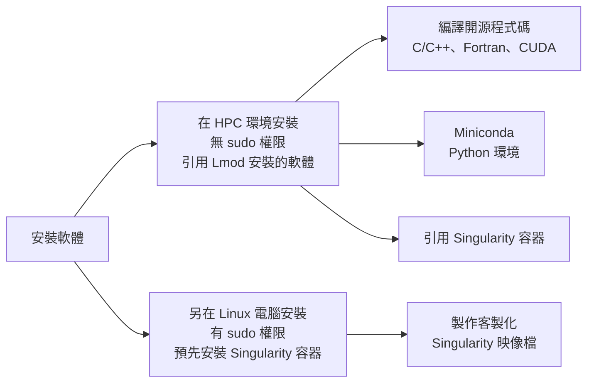

## [Slurm：任務調度工具，取得、查詢計算資源、提交作業。](https://github.com/robinfang7/nchc_hpc_tutorial/blob/main/slurm_lmod_container/Slurm.md)
## [Lmod：環境管理工具，引用已安裝的編譯器、函式庫、應用程式。](https://github.com/robinfang7/nchc_hpc_tutorial/blob/main/slurm_lmod_container/Lmod.md)
## [Container：引用已封裝依賴項與應用程式的獨立環境。](https://github.com/robinfang7/nchc_hpc_tutorial/blob/main/slurm_lmod_container/container.md)



## 安裝軟體
* 編譯語言：C/C++, Fortran, CUDA
   - 透過Lmod引用gcc, mpi, cmake, intel oneAPI
   - 編譯原始碼為執行檔

* 直譯語言：Python、R、Julia
   - 透過Lmod引用miniconda
   - pip install \<package\>  

### 原始碼編譯
1. 在登入節點，編譯原始碼  
   1.1 引用編譯器  
          `module load gcc, intel`  
   1.2 製作makefile  
          `mkdir build`  
          `cd build`  
          `cmake -DCMAKE_C_COMPILER=gcc -DCMAKE_CXX_COMPILER=g++ -DCMAKE_C_FLAGS="-g -O3" ..`  
   1.3 用4個CPU核心編譯makefile，產生執行檔  
          `make –j 4`  
   若編譯過程的時間過長，或佔用太多登入節點的資源，要用計算節點編譯。  
2. 執行運算的腳本
```bash
#sbatch ...

module purge
module gcc
module load intel

mpirun –n $SLURM_NTASKS <application> …
```

### Mininconda
1. 在登入節點，預先安裝環境  
   1.1 引用Miniconda  
   `module load mininconda3/24.11.1`  
   1.2 建立虛擬環境  
   `conda create <env_name> python=3.x -y`
   1.3 進入虛擬環境  
   `conda activate <env_name>`  
   1.4 安裝套件  
   `conda install <package>`  
   `pip install <package>`  
   安裝套件路徑  `~/.conda/envs/<env_name>/lib/python3.x/site-packages/...`  
   1.5 退出虛擬環境   
   `conda deactivate`  

2. 執行運算的腳本  
```bash
#sbatch ...

module purge
module load mininconda3/24.11.1
conda activate <env_name>

python train_script.py ...

conda deactivate
``` 

```bash

```

```bash

```

```bash

```


